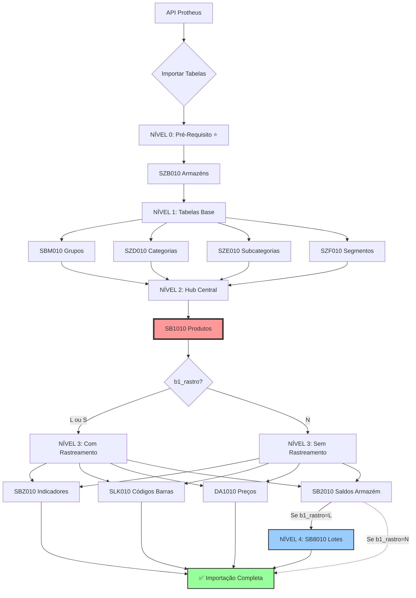
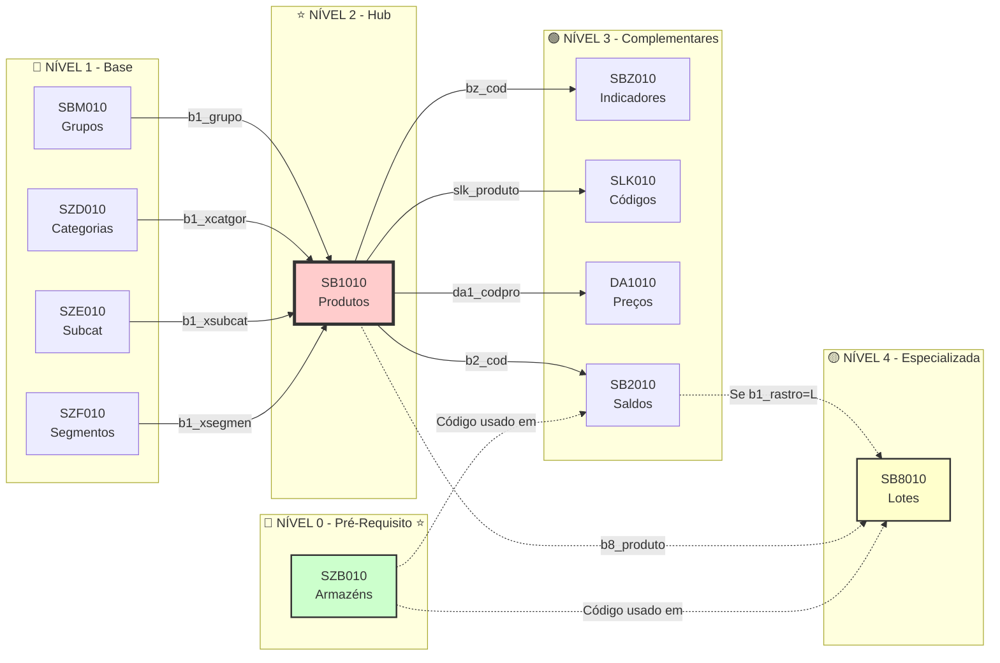

# 🗺️ DIAGRAMA DE RELACIONAMENTOS - Tabelas Protheus v1.1

**Data**: 20/10/2025
**Versão**: v1.1 ⭐ **ATUALIZADO**
**Status**: 📋 **DOCUMENTAÇÃO VISUAL**
**Changelog**: Adicionada tabela SZB010 (Armazéns/Locais)

---

## 📋 ÍNDICE

1. [Visão Geral](#1-visão-geral)
2. [Diagrama Completo (ASCII Art)](#2-diagrama-completo-ascii-art)
3. [Diagrama por Níveis](#3-diagrama-por-níveis)
4. [Diagrama Mermaid (Renderizável)](#4-diagrama-mermaid)
5. [Matriz de Relacionamentos](#5-matriz-de-relacionamentos)
6. [Ordem de Importação](#6-ordem-de-importação)

---

## 1. VISÃO GERAL

### 📊 Resumo dos Relacionamentos

**Total de Tabelas**: 11 ⭐ (SZB010 adicionada)
**Relacionamentos**: 15 ligações (FKs + implícitas)
**Hierarquia**: 5 níveis de dependência (0 a 4)

### 🎯 Tabela Hub Central
**SB1010 (Produtos)** é o coração do sistema:
- Recebe 4 FKs de entrada (grupos, categorias)
- Provê chave para 6 tabelas filhas

### 🔗 Tipos de Relacionamento
- **1:N** (Um para Muitos): 10 relacionamentos
- **N:1** (Muitos para Um): 4 relacionamentos

---

## 2. DIAGRAMA COMPLETO (ASCII ART)

```
┌──────────────────────────────────────────────────────────────────────────┐
│                        NÍVEL 0 - PRÉ-REQUISITO ⭐ NOVO                   │
│                    (Tabela independente de armazéns)                     │
└──────────────────────────────────────────────────────────────────────────┘

                        ┌─────────────────────────┐
                        │       SZB010            │
                        │ Cadastro de Armazéns    │
                        │─────────────────────────│
                        │ zb_filial    PK         │
                        │ zb_xlocal    PK         │
                        │ zb_xdesc                │
                        └────────┬────────────────┘
                                 │
                                 │ ⚠️ Usado por SB2/SB8 (b2_local, b8_local)
                                 │ 💾 Popula: warehouses (nossa aplicação)
                                 ↓

┌──────────────────────────────────────────────────────────────────────────┐
│                        NÍVEL 1 - TABELAS BASE                             │
│                    (Sem dependências externas)                            │
└──────────────────────────────────────────────────────────────────────────┘

    ┌─────────────┐   ┌─────────────┐   ┌─────────────┐   ┌─────────────┐
    │   SBM010    │   │   SZD010    │   │   SZE010    │   │   SZF010    │
    │   Grupos    │   │ Categorias  │   │Subcategorias│   │  Segmentos  │
    │─────────────│   │─────────────│   │─────────────│   │─────────────│
    │ bm_filial   │   │ zd_filial   │   │ ze_filial   │   │ zf_filial   │
    │ bm_grupo PK │   │ zd_xcod  PK │   │ ze_xcod  PK │   │ zf_xcod  PK │
    │ bm_desc     │   │ zd_xdesc    │   │ ze_xdesc    │   │ zf_xdesc    │
    └──────┬──────┘   └──────┬──────┘   └──────┬──────┘   └──────┬──────┘
           │                 │                 │                 │
           │ FK              │ FK              │ FK              │ FK
           │ b1_grupo        │ b1_xcatgor      │ b1_xsubcat      │ b1_xsegmen
           │                 │                 │                 │
           └─────────────────┴─────────────────┴─────────────────┘
                                     ↓

┌──────────────────────────────────────────────────────────────────────────┐
│                        NÍVEL 2 - TABELA HUB                               │
│                    (Recebe 4 FKs, Provê 6 FKs)                           │
└──────────────────────────────────────────────────────────────────────────┘

                        ┌─────────────────────────┐
                        │    ⭐ SB1010 (HUB)     │
                        │ Cadastro de Produtos    │
                        │─────────────────────────│
                        │ b1_filial PK            │
                        │ b1_cod    PK            │
                        │ b1_codbar               │
                        │ b1_desc                 │
                        │ b1_tipo                 │
                        │ b1_um                   │
                        │ b1_locpad               │
                        │ b1_grupo      FK →SBM   │
                        │ b1_xcatgor    FK →SZD   │
                        │ b1_xsubcat    FK →SZE   │
                        │ b1_xsegmen    FK →SZF   │
                        │ b1_xgrinve              │
                        │ b1_rastro ⚠️ CRÍTICO    │
                        └────────┬────────────────┘
                                 │
              ┌──────────────────┼──────────────────┬──────────────────┐
              │                  │                  │                  │
              ↓                  ↓                  ↓                  ↓

┌──────────────────────────────────────────────────────────────────────────┐
│                        NÍVEL 3 - TABELAS FILHAS                          │
│                    (Dependem de SB1010.b1_cod)                           │
└──────────────────────────────────────────────────────────────────────────┘

    ┌─────────────┐   ┌─────────────┐   ┌─────────────┐   ┌─────────────┐
    │   SBZ010    │   │   SLK010    │   │   DA1010    │   │   SB2010    │
    │ Indicadores │   │  Códigos    │   │   Preços    │   │   Saldos    │
    │             │   │  de Barras  │   │             │   │ por Armazém │
    │─────────────│   │─────────────│   │─────────────│   │─────────────│
    │ bz_filial   │   │ slk_filial  │   │ da1_filial  │   │ b2_filial   │
    │ bz_cod   FK │   │ slk_produto │   │ da1_codpro  │   │ b2_cod   FK │
    │ bz_local    │   │     FK      │   │     FK      │   │ b2_local    │
    │ bz_xlocal1  │   │ slk_codbar  │   │ da1_prcven  │   │ b2_qatu     │
    │ bz_xlocal2  │   │             │   │ da1_datvig  │   │ b2_qemp     │
    │ bz_xlocal3  │   │             │   │             │   │ b2_cm1  💰  │
    └─────────────┘   └─────────────┘   └─────────────┘   └──────┬──────┘
                                                                  │
                                                                  │ FK (se b1_rastro='L')
                                                                  ↓

┌──────────────────────────────────────────────────────────────────────────┐
│                        NÍVEL 4 - TABELA ESPECIALIZADA                    │
│                    (Apenas para produtos rastreáveis)                    │
└──────────────────────────────────────────────────────────────────────────┘

                                  ┌─────────────────────┐
                                  │      SB8010         │
                                  │   Saldos por Lote   │
                                  │─────────────────────│
                                  │ b8_filial           │
                                  │ b8_produto   FK     │
                                  │ b8_local            │
                                  │ b8_lotectl          │
                                  │ b8_saldo            │
                                  │ b8_dtvalid  📅      │
                                  │ b8_numlote          │
                                  └─────────────────────┘

LEGENDA:
  PK = Primary Key (Chave Primária)
  FK = Foreign Key (Chave Estrangeira)
  → = Relacionamento (N:1 - Muitos para Um)
  ↓ = Relacionamento (1:N - Um para Muitos)
  ⭐ = Tabela Hub Central ou Nova
  💰 = Campo de Custo (sensível)
  📅 = Data de Validade
  ⚠️ = Campo Crítico para Lógica de Negócio
  💾 = Popula tabela do sistema (não Protheus)
```

---

## 3. DIAGRAMA POR NÍVEIS

### 💾 Nível 0: Tabelas Pré-Requisito (1 tabela)

```
SZB010 (Cadastro de Armazéns/Locais) ⭐ TABELA INDEPENDENTE
├─ PK: (zb_filial, zb_xlocal)
├─ FKs RECEBIDAS: Nenhuma (tabela independente)
├─ FKs FORNECIDAS: Nenhuma (relacionamento implícito por código)
├─ Uso: Cadastro de armazéns/locais por filial
│  Exemplo: "01" + "01" = "Depósito Principal"
│            "01" + "02" = "Supermercado"
└─ ⚠️ IMPORTANTE:
   ├─ Não tem FK formal, mas é referenciado por:
   │  ├─ SB2010.b2_local (código do armazém)
   │  └─ SB8010.b8_local (código do armazém)
   └─ 💾 Popula tabela do sistema: warehouses
      └─ Mapeamento: zb_filial+zb_xlocal → warehouses.code
```

### 📊 Nível 1: Tabelas de Classificação (4 tabelas)

```
SBM010 (Grupos de Produtos)
├─ PK: bm_grupo
└─ Uso: Classificação de produtos em grupos amplos
   Exemplo: "0001 - ALIMENTOS", "0002 - BEBIDAS"

SZD010 (Categorias Customizadas)
├─ PK: zd_xcod
└─ Uso: Refinamento de classificação (nível 1)
   Exemplo: "CAT001 - REFRIGERANTES"

SZE010 (Subcategorias Customizadas)
├─ PK: ze_xcod
└─ Uso: Refinamento de classificação (nível 2)
   Exemplo: "SUB001 - COM GÁS"

SZF010 (Segmentos Customizados)
├─ PK: zf_xcod
└─ Uso: Refinamento de classificação (nível 3)
   Exemplo: "SEG001 - COLA"
```

### 🎯 Nível 2: Hub Central (1 tabela)

```
SB1010 (Cadastro de Produtos) ⭐ TABELA MESTRE
├─ PK: (b1_filial, b1_cod)
├─ FKs RECEBIDAS (4):
│  ├─ b1_grupo → SBM010.bm_grupo
│  ├─ b1_xcatgor → SZD010.zd_xcod
│  ├─ b1_xsubcat → SZE010.ze_xcod
│  └─ b1_xsegmen → SZF010.zf_xcod
├─ FKs FORNECIDAS (6):
│  ├─ → SBZ010.bz_cod
│  ├─ → SLK010.slk_produto
│  ├─ → DA1010.da1_codpro
│  ├─ → SB2010.b2_cod
│  └─ → SB8010.b8_produto (se b1_rastro='L')
└─ Campo Crítico: b1_rastro ('L'/'S'/'N')
   └─ Se 'L' → OBRIGA registros em SB8010
```

### 📦 Nível 3: Complementares (4 tabelas)

```
SBZ010 (Indicadores de Produtos)
├─ FK: bz_cod → SB1010.b1_cod
├─ Cardinalidade: 1:N (um produto pode ter múltiplas localizações)
└─ Uso: Informações de localização física (corredor, prateleira)

SLK010 (Códigos de Barras Adicionais)
├─ FK: slk_produto → SB1010.b1_cod
├─ Cardinalidade: 1:N (um produto pode ter múltiplos códigos)
└─ Uso: Códigos de barras alternativos (embalagens diferentes)

DA1010 (Tabela de Preços)
├─ FK: da1_codpro → SB1010.b1_cod
├─ Cardinalidade: 1:N (produto pode ter múltiplos preços/tabelas)
└─ Uso: Preços de venda por tabela e vigência

SB2010 (Saldos por Armazém)
├─ FK: b2_cod → SB1010.b1_cod
├─ Cardinalidade: 1:N (produto pode estar em múltiplos armazéns)
├─ ⚠️ ATENÇÃO: Se b1_rastro='L', b2_qatu pode estar ERRADO
└─ Uso: Estoque agregado por armazém (sem detalhamento de lote)
```

### 🏷️ Nível 4: Especializada (1 tabela)

```
SB8010 (Saldos por Lote)
├─ FK: b8_produto → SB1010.b1_cod
├─ Condição: Apenas se SB1010.b1_rastro = 'L'
├─ Cardinalidade: 1:N (produto pode ter múltiplos lotes)
├─ ✅ Fonte da Verdade: Para produtos rastreáveis, este é o saldo REAL
└─ Uso: Controle detalhado de lotes com validade

Regra Crítica:
  Para b1_rastro='L':
    Saldo CORRETO = SUM(SB8010.b8_saldo)
    Saldo ERRADO  = SB2010.b2_qatu  ❌ NÃO USAR!
```

---

## 4. DIAGRAMA MERMAID

### 4.1 Diagrama ER (Entity Relationship)

```mermaid
erDiagram
    SBM010 ||--o{ SB1010 : grupo
    SZD010 ||--o{ SB1010 : categoria
    SZE010 ||--o{ SB1010 : subcategoria
    SZF010 ||--o{ SB1010 : segmento

    SB1010 ||--o{ SBZ010 : indicadores
    SB1010 ||--o{ SLK010 : codigos_barras
    SB1010 ||--o{ DA1010 : precos
    SB1010 ||--o{ SB2010 : saldos_armazem
    SB1010 ||--o{ SB8010 : saldos_lote

    SZB010 {
        varchar zb_filial PK
        varchar zb_xlocal PK
        varchar zb_xdesc
        timestamp created_at
        timestamp updated_at
    }

    SBM010 {
        varchar bm_filial
        varchar bm_grupo PK
        varchar bm_desc
    }

    SZD010 {
        varchar zd_filial
        varchar zd_xcod PK
        varchar zd_xdesc
    }

    SZE010 {
        varchar ze_filial
        varchar ze_xcod PK
        varchar ze_xdesc
    }

    SZF010 {
        varchar zf_filial
        varchar zf_xcod PK
        varchar zf_xdesc
    }

    SB1010 {
        varchar b1_filial PK
        varchar b1_cod PK
        varchar b1_codbar
        varchar b1_desc
        varchar b1_tipo
        varchar b1_um
        varchar b1_locpad
        varchar b1_grupo FK
        varchar b1_xcatgor FK
        varchar b1_xsubcat FK
        varchar b1_xsegmen FK
        varchar b1_rastro
    }

    SBZ010 {
        varchar bz_filial
        varchar bz_cod FK
        varchar bz_local
        varchar bz_xlocal1
        varchar bz_xlocal2
        varchar bz_xlocal3
    }

    SLK010 {
        uuid id PK
        varchar slk_filial
        varchar slk_produto FK
        varchar slk_codbar
    }

    DA1010 {
        varchar da1_filial
        varchar da1_codtab
        varchar da1_codpro FK
        varchar da1_item
        numeric da1_prcven
        date da1_datvig
    }

    SB2010 {
        varchar b2_filial PK
        varchar b2_cod PK FK
        varchar b2_local PK
        numeric b2_qatu
        numeric b2_qemp
        numeric b2_cm1
    }

    SB8010 {
        uuid id PK
        varchar b8_filial
        varchar b8_produto FK
        varchar b8_local
        varchar b8_lotectl
        numeric b8_saldo
        date b8_dtvalid
    }
```

### 4.2 Diagrama de Fluxo de Importação



### 4.3 Diagrama de Dependências



---

## 5. MATRIZ DE RELACIONAMENTOS

### 5.1 Tabela de Relacionamentos Diretos

| De (Parent) | Para (Child) | Campo FK | Tipo | Cardinalidade | Obrigatório |
|-------------|--------------|----------|------|---------------|-------------|
| SZB010 | SB2010 | b2_local | Implícito** | - | Não |
| SZB010 | SB8010 | b8_local | Implícito** | - | Não |
| SBM010 | SB1010 | b1_grupo | N:1 | Muitos→Um | Não |
| SZD010 | SB1010 | b1_xcatgor | N:1 | Muitos→Um | Não |
| SZE010 | SB1010 | b1_xsubcat | N:1 | Muitos→Um | Não |
| SZF010 | SB1010 | b1_xsegmen | N:1 | Muitos→Um | Não |
| SB1010 | SBZ010 | bz_cod | 1:N | Um→Muitos | Sim |
| SB1010 | SLK010 | slk_produto | 1:N | Um→Muitos | Sim |
| SB1010 | DA1010 | da1_codpro | 1:N | Um→Muitos | Sim |
| SB1010 | SB2010 | b2_cod | 1:N | Um→Muitos | Sim |
| SB1010 | SB8010 | b8_produto | 1:N | Um→Muitos | Condicional* |

**Condicional***: Apenas se `SB1010.b1_rastro = 'L'`

**Implícito**: SZB010 não possui FK formal, mas os códigos de armazém (zb_xlocal) são usados por SB2010.b2_local e SB8010.b8_local como referência

### 5.2 Dependências Transitivas

```
SZB010 (independente) ⭐ NOVO
  ↓ (implícito)
  └── Códigos usados em SB2010.b2_local e SB8010.b8_local
      └── Não é FK, mas validação de domínio

SBM010 → SB1010 → SB2010 → SB8010
  ↓
Grupo de produtos determina produtos que determinam saldos

SZD010 → SB1010 → DA1010
  ↓
Categoria determina produtos que determinam preços
```

---

## 6. ORDEM DE IMPORTAÇÃO

### 6.1 Sequência Obrigatória (Respeitando Dependências)

```
FASE 0: Pré-Requisito - Armazéns ⭐ NOVO
└─ 0.1 → SZB010 (Cadastro de Armazéns/Locais)
         ↓
         ✅ Validação: Tabela importada (nenhuma dependência)
         💾 Efeito Colateral: Popula warehouses do sistema

FASE 1: Importação de Tabelas Base (SEM dependências)
├─ 1.1 → SBM010 (Grupos)
├─ 1.2 → SZD010 (Categorias)
├─ 1.3 → SZE010 (Subcategorias)
└─ 1.4 → SZF010 (Segmentos)
         ↓
         ✅ Validação: 4 tabelas importadas

FASE 2: Importação da Tabela Hub (DEPENDE de Fase 1)
└─ 2.1 → SB1010 (Produtos)
         ↓
         ✅ Validação: FKs para SBM/SZD/SZE/SZF existem

FASE 3: Importação de Complementares (DEPENDE de Fase 2)
├─ 3.1 → SBZ010 (Indicadores)
├─ 3.2 → SLK010 (Códigos de Barras)
├─ 3.3 → DA1010 (Preços)
└─ 3.4 → SB2010 (Saldos por Armazém)
         ↓
         ✅ Validação: FKs para SB1010 existem

FASE 4: Importação Especializada (DEPENDE de Fases 2 e 3)
└─ 4.1 → SB8010 (Saldos por Lote)
         ↓
         ✅ Validação:
            - FK para SB1010 existe
            - SB1010.b1_rastro = 'L' para o produto
            - SUM(b8_saldo) consistente com SB2010.b2_qatu
```

### 6.2 Validações Entre Fases

**Após FASE 0** ⭐ NOVO:
```sql
-- Verificar que armazéns foram importados
SELECT COUNT(*) FROM inventario.szb010; -- Deve ser > 0

-- Verificar que warehouses foram criados no sistema
SELECT COUNT(*) FROM inventario.warehouses; -- Deve ser > 0

-- Verificar mapeamento SZB010 → warehouses
SELECT
    szb.zb_filial,
    szb.zb_xlocal,
    szb.zb_xdesc,
    w.code AS warehouse_code,
    w.name AS warehouse_name
FROM inventario.szb010 szb
LEFT JOIN inventario.warehouses w ON w.code = szb.zb_xlocal
WHERE w.id IS NULL;
-- Resultado esperado: Apenas armazéns de filiais sem loja cadastrada no sistema
```

**Após FASE 1**:
```sql
-- Verificar que grupos/categorias foram importados
SELECT COUNT(*) FROM sbm010; -- Deve ser > 0
SELECT COUNT(*) FROM szd010; -- Pode ser 0 (opcional)
```

**Após FASE 2**:
```sql
-- Verificar produtos com grupos inválidos
SELECT b1_cod, b1_grupo
FROM sb1010
WHERE b1_grupo IS NOT NULL
  AND NOT EXISTS (SELECT 1 FROM sbm010 WHERE bm_grupo = b1_grupo);
-- Resultado esperado: 0 linhas
```

**Após FASE 3**:
```sql
-- Verificar saldos órfãos (produto não existe)
SELECT b2_cod
FROM sb2010
WHERE NOT EXISTS (SELECT 1 FROM sb1010 WHERE b1_cod = b2_cod);
-- Resultado esperado: 0 linhas
```

**Após FASE 4**:
```sql
-- Verificar consistência de lotes
SELECT
    sb1.b1_cod,
    sb1.b1_rastro,
    sb2.b2_qatu AS saldo_sb2,
    COALESCE(SUM(sb8.b8_saldo), 0) AS saldo_sb8,
    ABS(sb2.b2_qatu - COALESCE(SUM(sb8.b8_saldo), 0)) AS diferenca
FROM sb1010 sb1
JOIN sb2010 sb2 ON sb2.b2_cod = sb1.b1_cod
LEFT JOIN sb8010 sb8 ON sb8.b8_produto = sb1.b1_cod
WHERE sb1.b1_rastro = 'L'
GROUP BY sb1.b1_cod, sb1.b1_rastro, sb2.b2_qatu
HAVING ABS(sb2.b2_qatu - COALESCE(SUM(sb8.b8_saldo), 0)) > 0.01;
-- Resultado: Produtos com inconsistência entre SB2 e SB8
```

---

## 7. CASOS DE USO VISUAIS

### 7.1 Produto SEM Rastreamento

```
┌─────────────┐
│   SBM010    │
│ Grupo: 0001 │
└──────┬──────┘
       │ FK
       ↓
┌──────────────────┐
│     SB1010       │
│ Cod: 00010001    │
│ Rastro: N  ⚠️    │
└────┬────┬────┬───┘
     │    │    │
     ↓    ↓    ↓
┌─────┐ ┌──────┐ ┌───────┐
│SBZ  │ │SLK   │ │DA1    │
│Loc. │ │Barras│ │Preços │
└─────┘ └──────┘ └───┬───┘
                     │
                     ↓
               ┌───────────┐
               │  SB2010   │
               │ Saldo: 150│ ✅ FONTE DA VERDADE
               └───────────┘

SB8010: NÃO TEM registros (rastro='N')
```

### 7.2 Produto COM Rastreamento por Lote

```
┌─────────────┐
│   SBM010    │
│ Grupo: 0001 │
└──────┬──────┘
       │ FK
       ↓
┌──────────────────┐
│     SB1010       │
│ Cod: 00010037    │
│ Rastro: L  ⚠️    │ ← OBRIGA lotes!
└────┬────┬────┬───┘
     │    │    │
     ↓    ↓    ↓
┌─────┐ ┌──────┐ ┌───────┐
│SBZ  │ │SLK   │ │DA1    │
│Loc. │ │Barras│ │Preços │
└─────┘ └──────┘ └───┬───┘
                     │
                     ↓
               ┌───────────────────┐
               │     SB2010        │
               │ Saldo: 99999 ❌   │ ← PODE ESTAR ERRADO!
               └────────┬──────────┘
                        │ FK (se rastro='L')
                        ↓
               ┌─────────────────────┐
               │      SB8010         │
               ├─────────────────────┤
               │ Lote: 2024001       │
               │ Saldo: 144    ✅    │
               ├─────────────────────┤
               │ Lote: 2024002       │
               │ Saldo: 144    ✅    │
               └─────────────────────┘

Saldo CORRETO = SUM(SB8) = 288 ✅
Saldo ERRADO  = SB2 = 99999 ❌
```

---

## 8. GLOSSÁRIO DE SÍMBOLOS

| Símbolo | Significado |
|---------|-------------|
| **⭐** | Tabela Hub Central ou Nova |
| **💾** | Tabela Nível 0 - Popula sistema (warehouses) |
| **🔵** | Tabela de Nível 1 (Base) |
| **🟢** | Tabela de Nível 3 (Complementar) |
| **🟡** | Tabela de Nível 4 (Especializada) |
| **PK** | Primary Key (Chave Primária) |
| **FK** | Foreign Key (Chave Estrangeira) |
| **→** | Relacionamento N:1 (Muitos para Um) |
| **↓** | Relacionamento 1:N (Um para Muitos) |
| **⚠️** | Campo Crítico |
| **✅** | Validação/Sucesso |
| **❌** | Erro/Atenção |
| **💰** | Campo Sensível (Custo/Preço) |
| **📅** | Data/Timestamp |

---

**Documento criado em**: 20/10/2025
**Versão**: v1.1 ⭐ Atualizado
**Última Atualização**: 20/10/2025
**Status**: Documentação Visual
**Changelog v1.1**:
- ✅ Adicionada tabela SZB010 (Cadastro de Armazéns/Locais)
- ✅ Total de tabelas: 10 → 11
- ✅ Total de relacionamentos: 14 → 15
- ✅ Nova FASE 0 na ordem de importação
- ✅ Novos diagramas incluindo SZB010
- ✅ Validações SQL para FASE 0
**Ferramentas**: ASCII Art + Mermaid
**Renderização**: https://mermaid.live/ (para visualizar diagramas Mermaid)
