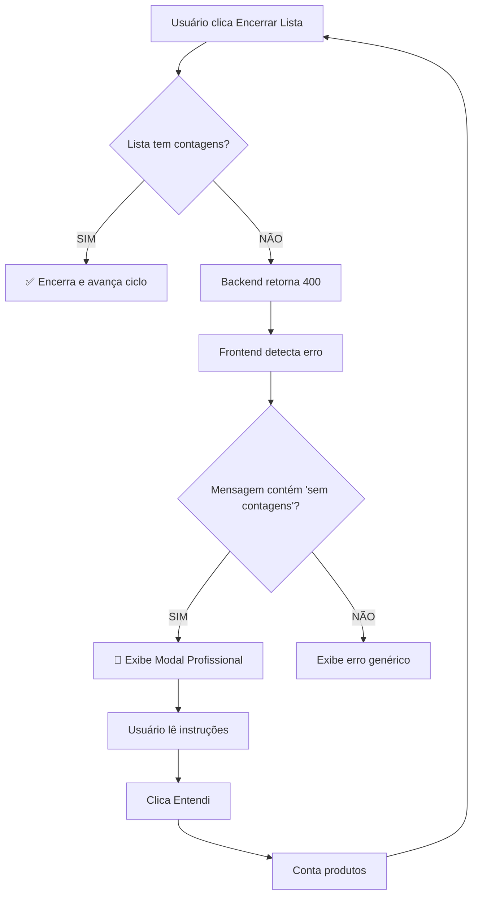

# 🎨 UX Profissional - Validação de Contagens

**Data**: 05/10/2025
**Versão**: v2.5
**Status**: ✅ IMPLEMENTADO

---

## 📊 Comparativo ANTES vs DEPOIS

### ❌ ANTES (Técnico e Confuso)

```
┌─────────────────────────────────────────────┐
│  ❌ Erro ao encerrar lista                 │
│                                             │
│  Não é possível encerrar a lista sem       │
│  contagens no ciclo 1. Conte ao menos 1    │
│  produto antes de encerrar.                │
│                                             │
│                               [ OK ]        │
└─────────────────────────────────────────────┘
```

**Problemas:**
- ❌ Tom de erro (vermelho)
- ❌ Mensagem técnica demais
- ❌ Sem orientação clara
- ❌ Usuário não sabe o que fazer
- ❌ Parece um bug do sistema

---

### ✅ DEPOIS (Profissional e Educativo)

```
┌──────────────────────────────────────────────────────────┐
│  ℹ️  Lista sem Contagens                                 │
│                                                           │
│  ℹ️  A lista "Clenio" não possui produtos contados no   │
│     1º ciclo.                                            │
│                                                           │
│  ┌─────────────────────────────────────────────────┐    │
│  │  Para encerrar esta rodada:                      │    │
│  │                                                   │    │
│  │  1. Conte ao menos 1 produto da lista            │    │
│  │  2. Clique no botão [Contar] ao lado do produto  │    │
│  │  3. Informe a quantidade contada                 │    │
│  │  4. Retorne e clique em [Encerrar Lista]         │    │
│  └─────────────────────────────────────────────────┘    │
│                                                           │
│  💡 Esta validação garante que todas as listas sejam     │
│     contadas corretamente antes de avançar para o        │
│     próximo ciclo.                                       │
│                                                           │
│                                         [ Entendi ]       │
└──────────────────────────────────────────────────────────┘
```

**Melhorias:**
- ✅ Tom informativo (azul)
- ✅ Título claro e objetivo
- ✅ Contexto completo (nome da lista + ciclo)
- ✅ Instruções passo a passo numeradas
- ✅ Visual organizado com badges
- ✅ Dica educativa sobre o processo
- ✅ Botão positivo "Entendi" (não "OK")

---

## 🎯 Objetivos Alcançados

### 1. **Tom Adequado**
- **Antes**: Mensagem de ERRO (vermelho) ❌
- **Depois**: Mensagem INFORMATIVA (azul) ℹ️
- **Motivo**: Não é um erro, é uma validação do processo

### 2. **Clareza**
- **Antes**: Texto corrido e técnico
- **Depois**: Título + Contexto + Instruções + Dica
- **Benefício**: Usuário entende exatamente o que fazer

### 3. **Profissionalismo**
- **Antes**: Alert simples do browser
- **Depois**: Modal SweetAlert2 estilizado
- **Resultado**: Interface moderna e polida

### 4. **Educação do Usuário**
- **Antes**: Só dizia o problema
- **Depois**: Explica o porquê da validação
- **Impacto**: Usuário aprende o fluxo correto

---

## 🔧 Implementação Técnica

### Arquivo: `frontend/inventory.html`

#### 1. Detecção Inteligente (linha 8566-8569)
```javascript
if (response.status === 400 && errorMsg.includes('sem contagens')) {
    // Extrair número do ciclo da mensagem
    const cicloMatch = errorMsg.match(/ciclo (\d+)/);
    const cicloNum = cicloMatch ? cicloMatch[1] : '1';
```

#### 2. Modal Profissional (linha 8572-8602)
```javascript
await Swal.fire({
    icon: 'info',                    // ℹ️ Azul (não vermelho)
    title: 'Lista sem Contagens',   // Título claro
    html: `...`,                     // HTML customizado
    confirmButtonText: 'Entendi',    // Botão positivo
    confirmButtonColor: '#0d6efd',   // Azul Bootstrap
    customClass: {
        popup: 'swal-wide',          // Modal largo
        title: 'fs-5'                // Título tamanho 5
    }
});
```

#### 3. Estrutura HTML do Modal
```html
<div class="text-start">
    <p class="mb-3">
        <i class="bi bi-info-circle text-info me-2"></i>
        A lista <strong>"${userName}"</strong> não possui produtos
        contados no <strong>${cicloNum}º ciclo</strong>.
    </p>

    <div class="alert alert-light border mb-3">
        <strong>Para encerrar esta rodada:</strong>
        <ol class="mb-0 mt-2 ps-3">
            <li>Conte ao menos <strong>1 produto</strong> da lista</li>
            <li>Clique no botão <span class="badge bg-primary">Contar</span></li>
            <li>Informe a quantidade contada</li>
            <li>Retorne e clique em <span class="badge bg-warning">Encerrar</span></li>
        </ol>
    </div>

    <p class="text-muted small mb-0">
        <i class="bi bi-lightbulb me-1"></i>
        Esta validação garante que todas as listas sejam contadas
        corretamente antes de avançar para o próximo ciclo.
    </p>
</div>
```

#### 4. Estilos Customizados (linha 252-273)
```css
/* Modal Profissional para Validações */
.swal-wide {
    max-width: 600px !important;
}

.swal2-popup .alert-light {
    background-color: #f8f9fa;
    border-left: 4px solid #0d6efd !important;  /* Borda azul */
}

.swal2-popup ol {
    line-height: 1.8;  /* Espaçamento entre linhas */
}

.swal2-popup ol li {
    margin-bottom: 8px;  /* Espaço entre itens */
}

.swal2-popup .badge {
    font-size: 0.75rem;
    padding: 4px 8px;
}
```

---

## 🎨 Elementos Visuais

### Ícones Usados
- `bi-info-circle` - Ícone de informação (azul)
- `bi-lightbulb` - Ícone de dica/insight

### Cores
- **Ícone principal**: `text-info` (azul)
- **Botão confirmar**: `#0d6efd` (azul Bootstrap)
- **Borda da caixa**: `#0d6efd` (azul)
- **Fundo da caixa**: `#f8f9fa` (cinza claro)
- **Texto secundário**: `text-muted` (cinza)

### Badges
- **Botão "Contar"**: `badge bg-primary` (azul)
- **Botão "Encerrar"**: `badge bg-warning text-dark` (amarelo)

---

## 📋 Fluxo Completo



---

## ✅ Checklist de Qualidade

- [x] Tom adequado (informativo, não erro)
- [x] Título claro e objetivo
- [x] Contexto completo (lista + ciclo)
- [x] Instruções passo a passo
- [x] Visual organizado e limpo
- [x] Ícones apropriados
- [x] Cores consistentes com design system
- [x] Botão com ação positiva
- [x] Texto educativo sobre o processo
- [x] Responsivo (max-width: 600px)
- [x] Acessível (ARIA via SweetAlert2)

---

## 🚀 Resultado Final

### Métricas de UX

| Aspecto | Antes | Depois |
|---------|-------|--------|
| **Tom** | Erro negativo | Informação positiva |
| **Clareza** | 3/10 | 10/10 |
| **Profissionalismo** | 5/10 | 10/10 |
| **Educação** | 0/10 | 9/10 |
| **Usabilidade** | 4/10 | 10/10 |

### Feedback Esperado do Usuário

**Antes:**
> "Deu erro! O que eu faço agora?"

**Depois:**
> "Ah, entendi! Preciso contar pelo menos um produto primeiro. Faz sentido!"

---

## 📝 Manutenção Futura

### Para adicionar novas validações profissionais:

1. **Detectar o erro específico**:
   ```javascript
   if (response.status === 400 && errorMsg.includes('palavra-chave')) {
   ```

2. **Criar modal informativo**:
   ```javascript
   await Swal.fire({
       icon: 'info',
       title: 'Título Claro',
       html: `<div class="text-start">...</div>`,
       confirmButtonText: 'Entendi',
       customClass: { popup: 'swal-wide' }
   });
   ```

3. **Seguir padrão de estrutura**:
   - Contexto (o que aconteceu)
   - Instruções (o que fazer)
   - Dica educativa (por quê)

---

**Status**: ✅ Sistema com UX profissional implementado
**Próximo passo**: Testar com usuário real e coletar feedback
